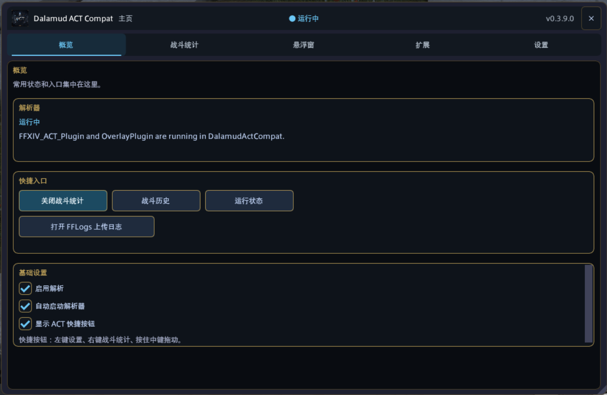
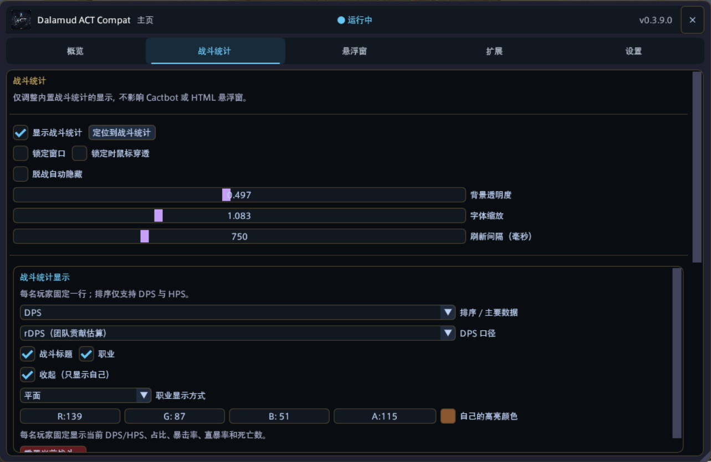
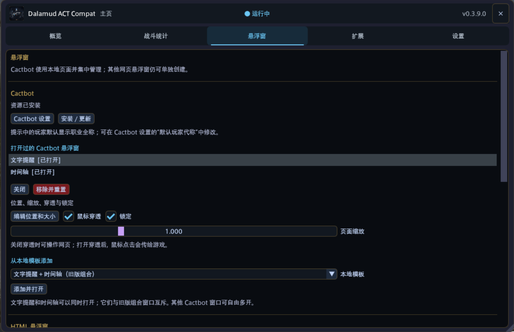
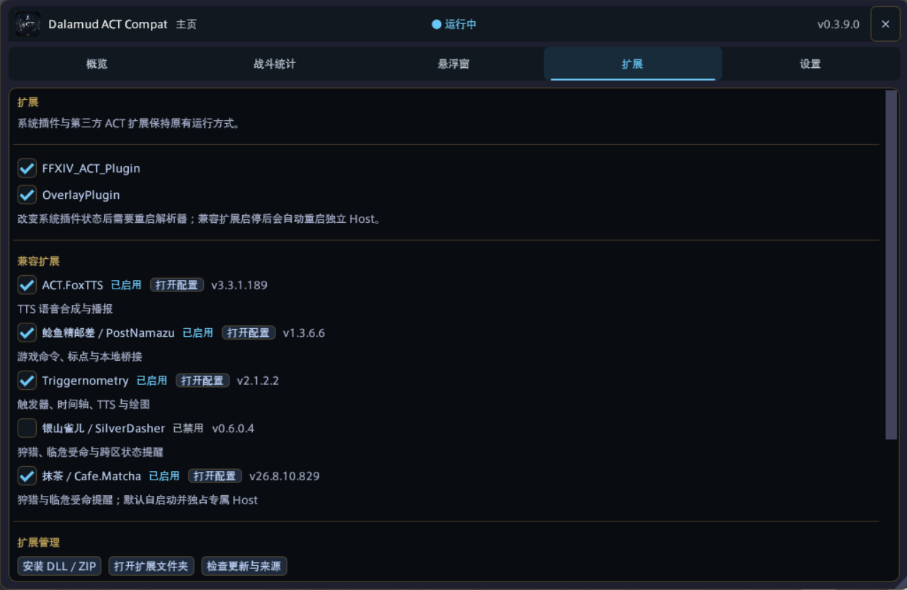
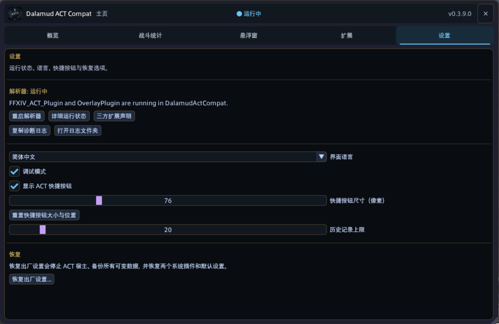
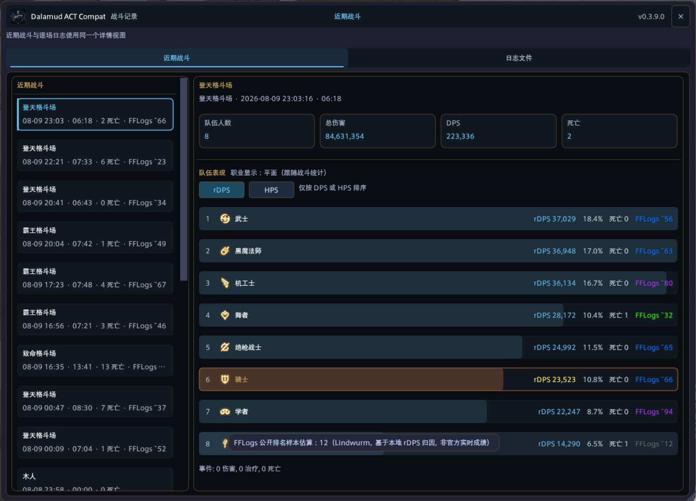
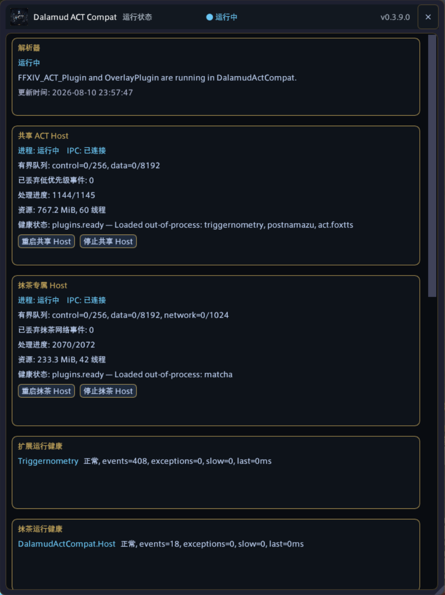

# Dalamud ACT Compat

[简体中文](README.md) | [English](README_EN.md)

[最新版本](https://github.com/JackyWilliam/DalamudActCompat/releases/latest) · [第三方扩展兼容说明](docs/third-party-compatibility.md) · [问题反馈](https://github.com/JackyWilliam/DalamudActCompat/issues)

**在 FFXIV 的 Dalamud 中直接使用战斗统计、Cactbot 悬浮窗和常见 ACT 扩展，不需要另外启动 ACT。**

Dalamud ACT Compat（简称 DACT）把 `FFXIV_ACT_Plugin`、`OverlayPlugin` 和游戏内界面整合进一个 Dalamud 插件。Triggernometry、鲶鱼精、FoxTTS 等传统 ACT 扩展运行在独立 Host 进程中；某个扩展卡死时，可以只重启对应 Host，不必立刻重启游戏。

> **DACT 是免费项目。** 插件和一次性激活码均不收费，请勿购买或转售；如果有人借 DACT 或激活码收费，请通过 [Issues](https://github.com/JackyWilliam/DalamudActCompat/issues)、QQ 群或 Discord 联系维护者。

目前主要在 **Windows、XIVLauncherCN、Dalamud API 15** 环境中发布和验证。它不是 Square Enix、Dalamud、ACT、FFLogs 或所捆绑第三方扩展的官方项目。

## 你可以用它做什么

| 功能 | 实际用途 |
| --- | --- |
| 游戏内战斗统计 | 查看 4/8/24 人 DPS、rDPS、HPS、总伤害、最高伤害、命中率、死亡和本地 FFLogs 区间估算 |
| 统计样式 | 经典榜、横版和职能分栏三选一；8 人经典表格可自定义，24 人使用固定的职业/名字 + DPS/HPS 紧凑条 |
| 战斗历史 | 按每次进本和每一把战斗保存记录，回看队伍数据与原始日志 |
| Cactbot / HTML 悬浮窗 | 安装 Cactbot 资源，在游戏内创建、缩放、锁定和穿透悬浮窗 |
| 常见 ACT 扩展 | 使用 Triggernometry、PostNamazu、ACT.FoxTTS、SilverDasher 和 Cafe.Matcha |
| 自行导入扩展 | 对 DLL/ZIP 做静态预检，确认权限后在通用 Host 中加载兼容的 ACT 插件 |
| 账号与云同步 | 使用激活码注册、可选自动登录、生成最多 3 个好友邀请码，并端到端加密备份配置 |
| 故障隔离与诊断 | 分开查看解析器、共享 Host、抹茶 Host 和通用 Host，按组件停止或重启 |

它不承诺兼容所有 ACT 插件。依赖旧版 .NET Framework、注入、任意内存读写、特殊 ACT 界面或未实现接口的扩展，可能无法运行。

## 安装

### 1. 添加自定义插件仓库

在游戏内输入 `/xlsettings`，打开 **实验性功能（Experimental）→ 自定义插件仓库**，添加下面的地址并保存：

```text
https://raw.githubusercontent.com/JackyWilliam/DalamudActCompatRepo/main/pluginmaster.json
```

### 2. 安装插件

输入 `/xlplugins`，搜索 **Dalamud ACT Compat**，点击安装。

0.3.10.0 起，Dalamud 先安装约 18 MiB 的核心包，插件再按缺失项获取 Host、Cactbot 和随包扩展资源；已验证的同版本缓存不会重复下载。下载中断可续传，更新失败时会保留上一份已验证资源。不要手动解压分包到插件目录。

### 3. 获取一次性激活码

注册 DACT 账号需要一次性激活码。请加入 QQ 群 **1098561701**，或加入 [Discord 服务器](https://discord.gg/HpQZErSPc)，联系群主或频道主获取。

> 激活码使用后即失效，请勿把收到的激活码发布到 Issue 或其他公开位置。`0.4.0.1` 的右上角游戏内帮助需要登录后才能打开；首次注册时请先参考本 README，这个限制将在后续版本修复。

### 4. 完成首次启动

1. 阅读首次弹出的第三方扩展声明，核对作者、来源、版本、权限和 SHA-256，再决定是否安装及授权。
2. 输入 `/actcompat` 打开控制中心。
3. 在“概览”确认“启用解析”和“自动启动解析器”已开启，顶部状态为“运行中”。
4. 输入 `/actcompat meter` 打开战斗统计，对木人或副本敌人造成有效伤害后即可看到数据。
5. 需要 Cactbot、Triggernometry、鲶鱼精或其他扩展时，再到“悬浮窗”和“扩展”页配置。

控制中心右上角有完整的游戏内帮助，支持中英文关键词搜索和宏指令复制。

> “打开 FFLogs 上传日志”只会打开本地 Network 日志目录并复制路径，不会自动上传。诊断日志用于排错，不能代替战斗日志。

## 界面预览



| 战斗统计设置 | Cactbot 与 HTML 悬浮窗 |
| --- | --- |
| [](docs/images/readme/combat-meter-settings.png) | [](docs/images/readme/overlay-settings.png) |
| **扩展管理** | **通用设置** |
| [](docs/images/readme/extension-management.png) | [](docs/images/readme/general-settings.png) |
| **战斗记录** | **运行状态** |
| [](docs/images/readme/encounter-history.png) | [](docs/images/readme/runtime-status.png) |

> 截图记录的是 v0.3.9.0 界面；后续版本沿用相同的信息结构，具体文字、版本号和选项以当前版本为准。点击小图可查看原图。

## 控制中心

| 页面 | 这里能做什么 |
| --- | --- |
| 概览 | 查看解析器状态；开关解析、自动启动、失焦隐藏网页悬浮窗和精简模式；打开统计、历史、运行状态与日志目录 |
| 战斗统计 | 在三个互斥模板间切换；设置 8/24 人模式、DPS/HPS 排序、独立统计槽位、透明度和 FFLogs 估算 |
| 悬浮窗 | 安装 Cactbot；管理文字提醒、时间轴和自定义 HTML 悬浮窗；设置游戏失焦时隐藏网页悬浮窗 |
| 扩展 | 启停扩展；打开扩展配置；检查来源与更新；导入 DLL/ZIP；分配权限 |
| 云同步 | 注册或登录账号；选择是否自动登录；管理好友邀请码；上传、预览、恢复或回滚端到端加密配置 |
| 设置 | 自动检测或手动选择国服/国际服；重启解析器；复制诊断；设置语言和快捷按钮；执行需再次确认的恢复出厂设置 |

“游戏区域”默认读取游戏 Framework 的原生客户端区域值：国服客户端使用国服网络协议，国际服客户端使用国际服网络协议；不根据 Dalamud 语言或安装路径判断，因此国际服中文语言包不会被误判。无法读取游戏区域时暂按国际服处理，并可手动覆盖；切换后插件会刷新正在运行的解析器与扩展 Host，而动作名和日志语言仍跟随游戏客户端。FFLogs 区间估算会同步使用国服 CN 分区或国际服最新全球分区。

## 常用命令

| 命令 | 作用 |
| --- | --- |
| `/actcompat` | 打开或关闭控制中心 |
| `/actcompat on` / `/actcompat off` | 明确打开 / 关闭控制中心 |
| `/actcompat meter` | 打开并定位战斗统计 |
| `/actcompat simple on` / `/actcompat simple off` | 进入 / 退出精简模式；精简主页只保留统计窗开关与退出入口 |
| `/actcompat history` | 打开近期战斗 |
| `/actcompat logs` | 打开已保存的日志文件列表 |
| `/actcompat status` | 查看解析器与各 Host 的运行状态 |
| `/actcompat cactbot` | 打开当前选择的 Cactbot 悬浮窗 |
| `/actcompat overlay [模板名]` | 打开当前或指定的 HTML 悬浮窗 |
| `/actcompat clear` | 清空当前战斗显示，不删除历史或原始日志 |

诊断与开发命令还包括 `/actcompat host`、`stop`、`sample`、`install "<DLL 或 ZIP 路径>"` 和 `factory-reset`。输入未知子命令时，插件会打开内置的完整命令页。

## 战斗统计怎么理解

- **DPS**：按每名玩家自己的有效动作时长计算。
- **EncDPS**：按整场战斗经过时间计算，更接近传统 ACT 的整场口径。
- **rDPS**：根据本地战斗事件和团队增益归属实时估算，不等于 FFLogs 服务器端结果。
- **HPS**：按本把战斗从开怪到结束的完整时间计算，包括转阶段和目标不可选中的时间。
- **最高伤害**：记录本场最高的一次命中；之后出现更高伤害时替换，相同伤害不抖动，下一场重新记录。
- **FFLogs 区间估算**：把本场数据代入本地缓存曲线，只用于即时参考，不是上传后的正式排名。
- **`--`**：当前还没有足够的有效数据，不表示数值为零。

战斗结束后，实时统计会保留上一把结果；下一场出现有效数据后才从零替换。副本内团灭重开后也遵循这一规则；历史页仍把同一次进本放在一个文件夹里，每一把作为独立子记录保存。转阶段产生的 ACT 片段只在内部合并，不会被误拆成多把。

“重置当前战斗”只结束并清空当前显示，不会删除已经保存的历史和原始 Network 日志。玩家 ID 遮盖也只影响界面显示，不会改写日志内容。

## 扩展、权限与重启

“启用扩展”和“开放权限”是两个独立条件。一个扩展显示已启用，不代表它已经获得网络、文件、游戏指令、原生内存或高风险脚本权限。

| 组件 | 运行位置 | 更新或异常后优先操作 |
| --- | --- | --- |
| Triggernometry、PostNamazu、ACT.FoxTTS、SilverDasher | 共享 Host | `/actcompat status` →“重启共享 Host” |
| Cafe.Matcha | 抹茶专属 Host | `/actcompat status` →“重启抹茶 Host” |
| 自行导入的普通 ACT 扩展 | 通用 Host | `/actcompat status` →“重启通用 Host” |
| FFXIV_ACT_Plugin、OverlayPlugin | 游戏内解析器 | 控制中心“设置”→“重启解析器” |

传统 ACT 扩展以当前 Windows 用户权限运行。独立 Host 能避免大多数扩展崩溃直接带走 FFXIV，但它不是操作系统沙箱；同一 Host 内的恶意 DLL 仍可能调用桌面 API 或影响其他扩展。只安装可信来源，并只开放实际需要的权限。

第三方组件的维护来源、随包版本、安装模型和已验证范围见[第三方 ACT 扩展兼容说明](docs/third-party-compatibility.md)。

## 常见问题

### `/actcompat` 没反应或提示命令不存在

在 `/xlplugins` 中确认 Dalamud ACT Compat 已安装、已启用且没有加载错误。此时插件内的重启和诊断按钮也无法工作，先处理 Dalamud 显示的加载错误。

### 战斗统计窗口不见了或一直为空

1. 输入 `/actcompat meter`，并暂时关闭“脱战自动隐藏”。
2. 确认“概览”和 `/actcompat status` 中的解析器都是“运行中”。
3. 对木人或副本敌人实际造成几次有效伤害；仅进本、选中目标或打开窗口不会产生数据。
4. 仍为空时重启解析器，并重新产生一场新样本。

### 只有某个扩展、TTS、触发器或标点不能用

先确认扩展本身已启用且权限足够，再到 `/actcompat status` 只重启它所在的 Host。不要在解析器未运行时反复重装下游扩展。

### 悬浮窗能显示网页，但没有战斗数据

网页打开不等于数据协议已经连接。先确认解析器和 OverlayPlugin 正在运行，再检查该悬浮窗的现代 OverlayPlugin / ACTWS 自动检测状态并执行“重新检测”。

### 反馈问题需要什么

请提供 DACT 版本、发生时间、复现步骤、预期结果、实际现象、`/actcompat status` 中第一个失败的组件和“复制诊断日志”的完整内容。统计缺失或数值异常还需保留对应的 `Network_*.log`。提交前请自行检查角色名、服务器名和本地路径。

## 它是怎么运行的

```text
FFXIV / Dalamud 进程
└─ Dalamud ACT Compat
   ├─ FFXIV_ACT_Plugin + OverlayPlugin
   ├─ 控制中心、战斗统计、历史与悬浮窗
   ├─ 账号、邀请和本机加密的云配置同步
   └─ 有界 IPC
      ├─ 共享 Host：Triggernometry / PostNamazu / FoxTTS / SilverDasher
      ├─ 抹茶 Host：Cafe.Matcha
      └─ 通用 Host：用户导入的兼容 ACT 扩展
```

解析器和 OverlayPlugin 留在游戏进程中，以便直接接收 Dalamud 数据并绘制界面；传统 ACT 扩展放到独立进程中，便于限流、诊断、停止和重启。IPC 只开放经过定义的消息和游戏指令入口，不向 Host 暴露任意函数指针。

## 开发与构建

需要 Windows、.NET 10 SDK、Git 子模块和 Dalamud API 15 开发文件。

```powershell
git clone --recurse-submodules https://github.com/JackyWilliam/DalamudActCompat.git
cd DalamudActCompat
dotnet restore DalamudActCompat.slnx
dotnet build DalamudActCompat.slnx -c Release
```

GitHub Actions 会在 Windows runner 上构建完整 solution，并执行 Package、Host 和 Legacy Resource smoke tests。正式发布还会在装有 XIVLauncher/Dalamud 开发文件的 Windows 环境中同步固定依赖、重新打包并校验发布物。

发布和实现细节：

- [自定义仓库发布流程](docs/CUSTOM_REPOSITORY.md)
- [Windows 自定义仓库测试](docs/WINDOWS_CUSTOM_REPO_TEST.md)
- [ACT Host 隔离设计](docs/act-host-isolation.md)
- [兼容层调查记录](docs/act-compat-phase2-investigation.md)
- [第三方许可证与告知](THIRD_PARTY_NOTICES.md)

## 许可证

Dalamud ACT Compat 以 [GPL-3.0](LICENSE.md) 发布。随包第三方组件分别遵循各自许可证；详情见 [THIRD_PARTY_NOTICES.md](THIRD_PARTY_NOTICES.md) 和发布包内的 `LICENSES/` 目录。
